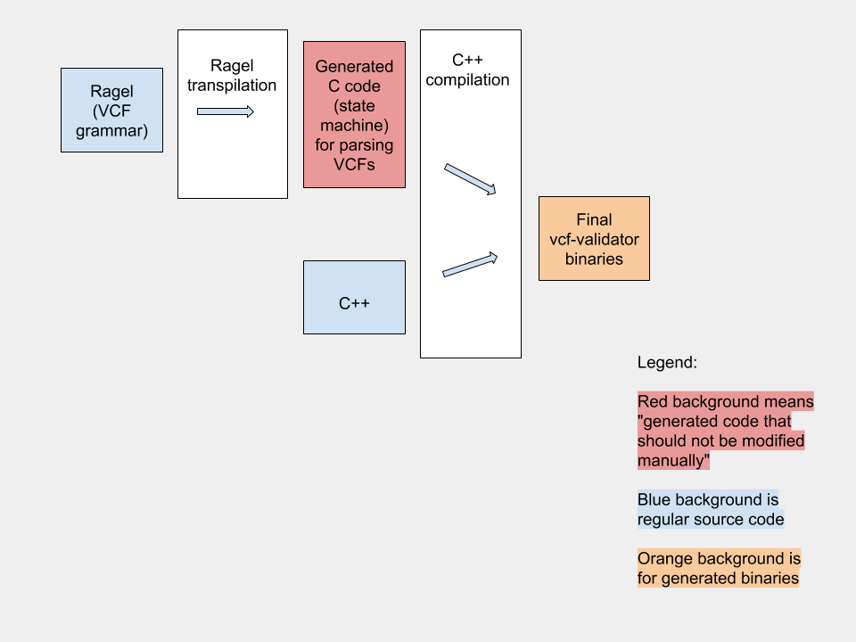

# Developer guide

This page explains how the project is structured and hopefully gives a quick
tour so that any new developer understands how to make and deploy any
maintenance or new features. However, this mostly provides understanding; for a
practical guide to get the project compiled see the [README.md](../README.md).

This page tries to start explaining from less-technical higher level and go down
into the programming technical details.


## Build process overview

This is a C++ project that produces 3 binaries: vcf-validator,
vcf-assembly-checker and vcf-debugulator. The build is done with CMake (file
[CMakeLists.txt](../CMakeLists.txt)) for Linux, Windows and macOS. There are
scripts to help installing the dependencies
([install_dependencies.sh](../install_dependencies.sh)) for Linux and macOS, and
[install_dependencies.bat](../install_dependencies.bat) for Windows).

We also use TravisCI ([.travis.yml](../.travis.yml)) and AppVeyor
([appveyor.yml](../appveyor.yml)) to do builds and run tests on Pull Requests
and to generate the binaries from tags in master that we upload to the releases
page (https://github.com/EBIvariation/vcf-validator/releases).

### Deploying

Once we tag a commit in master and push the tag, travis will generate binaries
for Linux and macOs, and AppVeyor will generate the Windows ones.

The process is semi-automatic at the moment of writing. Travis will prepare a
new Releases page with no description but will upload the binaries. The manual
step is to download the Windows binaries from AppVeyor and upload to that page,
and also fill the release notes.


## Compilation architecture

This image is a summary of the compilation process from source code to
executable binaries:



In case of dependent libraries being installed in non-standard paths,
update LIBRARY_PATH as shown below
  'export LIBRARY_PATH=$LIBRARY_PATH:<path to required library's libpath>'

The role of Ragel in this project is explained further below.

## Code structure

As opposed to java projects where interfaces and implementations are often put
in the same packages, it's not uncommon in C and C++ to separate headers (.hpp)
and implementation (.cpp) files. In this project the headers are in
[`inc/`](../inc/) and the implementation in [`src/`](../src/). Both the tests
source code and the test data is in [`test/`](../test/).

Java packages are roughly equivalent to C++ namespaces. However, in C++ the
namespaces and the folders do not need to match. In this project we use
different namespaces (and matching folders) for different topics: vcf, fasta,
assembly_report, util.

The programs' entry points (the `main()`s) are
[src/validator_main.cpp](../src/validator_main.cpp) and
[src/assembly_checker_main.cpp](../src/assembly_checker_main.cpp).

## Features' location

If you need to change something in this project you need to understand what
features there are, and where are they implemented.

### VCF Validator features

The VCF Validator is the main program of this project and it performs syntax and
semantic checks on a given (possibly compressed) VCF.

After parsing the input VCF, the semantic checks are performed on a C++ model of
VCF (including the metadata section), and `Error` classes (related among
themselves by hierarchical inheritance) are used to represent different types of
possible errors.

Based on those `Error`s, the program can produce human-readable reports and a
machine-readable report that the VCF Debugulator can read to fix some basic
errors. Later, this machine-readable report and Debugulator support were removed
to make build, packaging and installation simpler.

The level of checks can be configured, from doing just a quick syntax check, to
raise warnings of suspicious details.

#### Compression

A tricky but not complex step is to decompress on the fly the VCF if needed.
See [inc/vcf/compression.hpp](../inc/vcf/compression.hpp).

#### Syntax checks - Ragel

[Ragel](http://www.colm.net/open-source/ragel/) is a library to create
regex-powered parsers. In a language similar to
[BNF](https://en.wikipedia.org/wiki/Backus%E2%80%93Naur_form), we have defined
the grammar of VCF.

The common and basic definitions are in
[src/vcf/vcf.ragel](../src/vcf/vcf.ragel), and then the parts that differ
between versions are defined in
[src/vcf/vcf_v41.ragel](../src/vcf/vcf_v41.ragel),
[src/vcf/vcf_v42.ragel](../src/vcf/vcf_v42.ragel),
[src/vcf/vcf_v43.ragel](../src/vcf/vcf_v43.ragel) and
[src/vcf/vcf_v44.ragel](../src/vcf/vcf_v44.ragel).

Those files not only describe the regex that define the syntax, they also define
the points of the grammar where the semantic checks are injected.

Those files are transpiled with Ragel into C code with the next commands:
```
ragel -G2 src/vcf/vcf_v41.ragel -o inc/vcf/validator_detail_v41.hpp
ragel -G2 src/vcf/vcf_v42.ragel -o inc/vcf/validator_detail_v42.hpp
ragel -G2 src/vcf/vcf_v43.ragel -o inc/vcf/validator_detail_v43.hpp
ragel -G2 src/vcf/vcf_v44.ragel -o inc/vcf/validator_detail_v44.hpp
```

#### VCF parsing, policies and file structure

Now, we have the generated code by ragel that parses the VCF, but how is that
code called if we start at `main()`?

At the end of the src/vcf/vcf_v*.ragel files we tell Ragel to put the parser as
implementation of the ParserImpl class, which is defined in
[inc/vcf/validator.hpp](../inc/vcf/validator.hpp). In that file we declare the
parsing classes, some functions to kickstart the parsing, and the plugging of
the policies into the parsers.

After Ragel has parsed each VCF line, the policies are the way to configure the
Parser classes for the level of semantic checks:

- [inc/vcf/parse_policy.hpp](../inc/vcf/parse_policy.hpp) declares the policy of
  either storing the result of parsing into the VCF C++ model, or just forget
  the data if the user only wants to check syntax. The model for each VCF line
  is a MetaEntry or a Record (defined in
  [inc/vcf/file_structure.hpp](../inc/vcf/file_structure.hpp)).

- [inc/vcf/optional_policy.hpp](../inc/vcf/optional_policy.hpp) declares the
  policy of whether to check also for warnings, or just errors. Warnings usually
  flag weird things that are compliant with the spec but that you wouldn't expect
  from a reasonable VCF.

- [inc/vcf/error_policy.hpp](../inc/vcf/error_policy.hpp) declares the policy to
  stop on the first error, or read the whole VCF and produce a report.


#### Semantic checks

Once we have a Record containing the information of a line (chromosome,
position, alleles, INFO and GT columns, etc.), some more functions are called to
check the consistency of the data, also in relation to the definitions in the
metadata section of the VCF.

Some of these functions are part of the policies. For instance, the check that
each sample only appears once and the check that the contigs and positions are
sorted are both implemented in
[src/vcf/store_parse_policy.cpp](../src/vcf/store_parse_policy.cpp). The
semantic checks that are warnings are implemented in
[src/vcf/validate_optional_policy.cpp](../src/vcf/validate_optional_policy.cpp).

A notable exception is the check for duplicate variants, which, for pragmatic
reasons, was done in vcf.ragel (search `action record_end {`). The check for
duplicate variants uses a [RecordCache](../inc/vcf/record_cache.hpp) to compare
nearby variants, and this in turn uses a naive
[normalizer](../inc/vcf/normalizer.hpp) that removes redundant context bases
from the alleles and tweaks the position accordingly, but doesn't do full
realignment using the reference sequence.


#### Reporting

Once an error or a warning is detected, an exception is thrown from the
appropiate class in [inc/vcf/Error.hpp](../inc/vcf/Error.hpp). We take advantage
of polymorphism when we catch those exceptions in vcf.ragel (again, search for
`action record_end`).

If the policy to report the errors is in use, the parser has the list of
report writers the user requested. These can be any combination of
[simple report](../inc/vcf/record.hpp), [summary
report](../inc/vcf/summary_report_writer.hpp), and [ODB
report](../inc/vcf/odb_report.hpp).

ODB is a library for Object Relational Mapping. In other words, we use it to
serialize the class data of errors, so that the debugulator can deserialize
the error details directly into variables and classes without parsing.

We use ODB mostly in [inc/vcf/Error.hpp](../inc/vcf/error.hpp), through some
pragmas. The way ODB works is parsing the C++ classes that have ODB pragmas and
outputs C++ code that serializes the class instance information into a SQL
database. We chose Sqlite as database backend, which means that the DB reports
can actually be opened with a Sqlite client.

The debugulator had very minimal functionality and limited usage. To reduce the
build, packaging and installation complexities, a few of the dependencies were
removed and ODB is one among them. Along with ODB, debugulator was also removed
from build as it is fully dependent on ODB. The sources and part of
documentation retained for future reference.

### VCF assembly checker

This program is much simpler than the validator. It's mostly about getting the
reference sequence from a FASTA file and comparing it to the REF allele of each
line in a VCF.

This is done in [inc/vcf/assembly_checker.hpp](../inc/vcf/assembly_checker.hpp)
and its implementation file
[src/vcf/assembly_checker.cpp](../src/vcf/assembly_checker.cpp), with the help
of some FASTA utilities in [inc/fasta/](../inc/fasta).

There are 3 ways to retrieve FASTA files:

- The user provides a file.
- The VCF contains a `##reference` which we use to download a FASTA from ENA.
- The VCF contains `##contig` entries and we use those contig accessions to
  download individual sequences.

There's also limited support to use assembly reports
([inc/assembly_report/assembly_report.hpp](../inc/assembly_report/assembly_report.hpp))
and translate between synonym contig names/accessions in case the nomenclature
in the VCF and in the FASTA don't match.

### VCF Debugulator

At the beginning of the project we expected there would be interesting
situations were we could use the ODB report to fix automatically wrong VCFs.
Sadly, it turned out that there's not much an automated program can do, really.

The fixes are implemented in [inc/vcf/fixer.hpp](../inc/vcf/fixer.hpp) and 
[src/vcf/fixer.cpp](../src/vcf/fixer.cpp), and basically consist on removing
duplicate variants and dropping entire fields that are non-conforming with the
spec.

The debugulator had very minimal functionality and limited usage. To reduce the
build, packaging and installation complexities, a few of the dependencies were
removed and ODB is one among them. Along with ODB, debugulator was also removed
from build as it is fully dependent on ODB. The sources and part of
documentation retained for future reference.

## Testing

Testing is performed with [Catch](https://github.com/catchorg/Catch2) in the
[`test/`](../test/) folder. The folders test/vcf/, test/fasta/ and
test/assembly_report/ contain test source code, and test/input_files contain a
medium-sized set of correct and wrong VCFs that are used in the tests.

## ODB dependency

ODB was in use earlier and it has now been removed. Debugulator was also removed
along with it as it depends on ODB.
